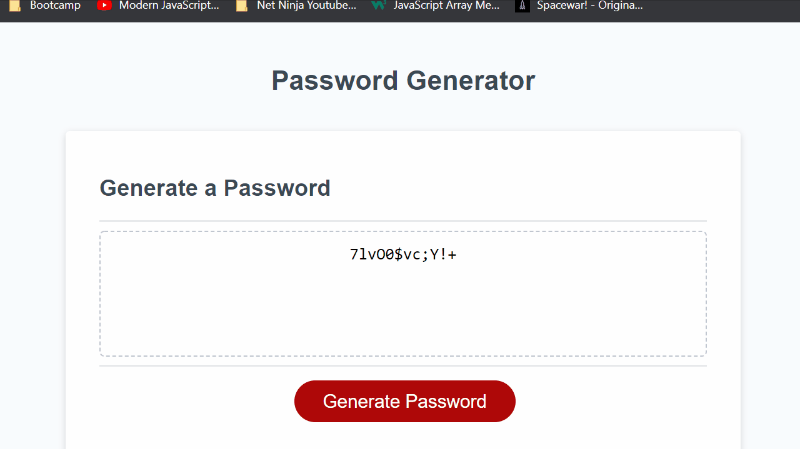

# **Password Generator**

Given a pre-made html page setup with a password box and a "Generate Password" button, I was tasked with writing the javascript code necessary to prompt user for password requirements and then generate that password.

---

## Contents:
* [Live Page Link](#live-page-link)
* [Demo](#demo-of-project)
* [Usage](#usage)
* [Skills/Concepts Used](#skillsconcepts-used)
* [Steps Taken](#steps-taken)
* [Final Thoughts/Ideas For Improvement](#final-thoughtsideas-for-improvement)

---

## Live Page Link:

[https://rbishop85.github.io/password-generator/](https://rbishop85.github.io/password-generator/)

---

## Demo of Project:

---

## Usage:

When the user first loads the page they will be presented with a box labelled as a password generator with a red button they can click to start the process of generating a custom password.

Upon clicking the button the user will be asked for a password length (between 8 and 128 characters).  If their input contains a value that is too short, too long or contains anything other than numbers then they will receive a popup reminding them of the 8-128 character requirement and given another chance to key in a value.  Once they input a proper number they will continue to the next step.

Next they will be asked what types of characters they wish to include in their password (Upper Case Letters, Lower Case Letters, Numbers and Special Characters).  If they decline all 4 then they will receive a prompt reminding them that they must at least select one and then they'll be given another chance to select.

After selecting all criteria the password will be randomly generated, checked to ensure that it meets all selected criteria and then printed to the screen for the user.

---

## Skills/Concepts Used:
* Javascript
  - Functions
  - Variables & Arrays
  - If Statements
  - For Loops
  - Math Methods
  - Strict Equality (===)

---

## Steps Taken:
1. Created 4 separate variables containing the individual character choices for each of the 4 character types, then split them into arrays containing the individual characters.
2. Created a function that prompted the user for the required password length, ran checks to make sure the entered value met the 8-128 character criteria, then returned the resulting length.
3. Created a function that confirmed which of the 4 character types the user wished to use in their password, enforcing that the user select at least one type.
4. Used concat to combine the arrays of the chosen character types into one pool of potential characters for the password.
5. Created a function that randomly pulled a number of characters from that pool equal to the requested password length and then used concat to put them all together.  Then verified that the random selection process was successful in selecting at least one character of each type requested.  If any requested types were missed then the password would be automatically redone until it met all criteria.
6. Finally the accepted password that meets all criteria is returned to the orginally provided code to be output on the screen.

---

## Final Thoughts/Ideas For Improvement:

In the future I could see creating a cleaner interface for gathering a user's password requirements instead of just using alerts, prompts and confirms.  Maybe clean up the look of the page as a whole.  Possibly adding some more options for password generation such as space or specific sets of special characters.  It could also be handy to be able to input a set of criteria and automatically generate multiple passwords that meet that criteria.

---

[Top of Page](#password-generator)